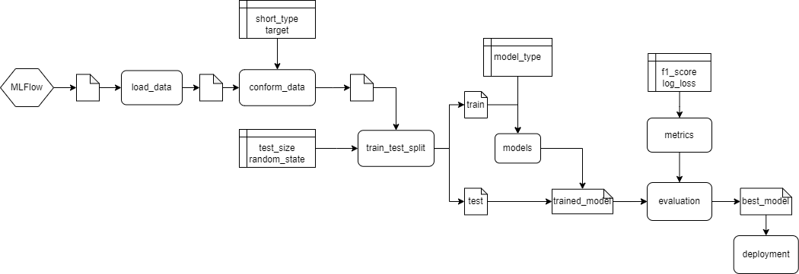

# Questions

## 1. Repositório no Github

https://github.com/higoreller/microsoft_tdsp_ml_engineering

## 2. Diagrama

## 3. Descreva a importância de implementar pipelines de desenvolvimento e produção numa solução de aprendizado de máquinas.

Os pipelines são importantes para a segmentação do desenvolvimento, para que a equipe tenha as etapas do processo bem definidas. Isso permite manutenabilidade e facilidade na hora de novas implementações. Os dados mudam constantemente, com isso as métricas também variam, e um modelo antes considerado adequado rapidamente pode se tornar obsoleto. Sendo assim, é importante padronizar os projetos, neste sentido a Microsoft desenvolveu o TDSP para a realizar tal padronização e lidar com os artefatos de um projeto de machine learning. Atualmente, existem diversos desafios na parte de engenharia de machine learning devido às particularidades mencionadas, colocar um modelo desses em produção é, no geral, um pouco mais complexo que outros tipos de projetos devido o seu dinamismo. Este fato reforça a importância de pipelines de dados bem definidos para lidar com esse dinamismo.

## 4. Como as ferramentas Streamlit, MLFlow, PyCaret e Scikit-Learn auxiliam na construção dos pipelines descritos anteriormente? A resposta deve abranger os seguintes aspectos:

A variação dos parâmetros dos modelos é um aspecto importante em machine learning, desta forma ferramentas como o MLFlow, PyCaret e Scikit-Learn possuem ferramentas de rastreamento de experimentos que possibilitam verificar o resultados das métricas selecionadas para determinados conjuntos de dados e de parâmetros. Sendo assim, pode-se acompanhar a saúde dos modelos criados com o passar do tempo. PyCaret e Scikit-Learn oferecem uma ampla gama de algoritmos de aprendizado de máquinas e funções de pré-processamento para simplificar o treinamento e a validação dos modelos. MLFlow pode ser usado para monitorar a performance dos modelos em produção, registrando métricas e identificando degradações no desempenho. Com o uso de MLFlow, é possível registrar e gerenciar várias versões dos modelos, facilitando a atualização e a manutenção. MLFlow permite a implantação de modelos como APIs RESTful, facilitando a integração com outros sistemas. Streamlit pode ser usado para criar visualizações e aplicativos web interativos para apresentar os resultados do modelo.

## 5. Com base no diagrama realizado na questão 2, aponte os artefatos que serão criados ao longo de um projeto. Para cada artefato, indique qual seu objetivo.

- Código-fonte: Scripts e notebooks contendo o código para aquisição de dados, pré-processamento, treinamento, avaliação e implantação.
- Dados processados: Conjuntos de dados após o pré-processamento e a divisão em treino e teste.
- Modelos treinados: Modelos de aprendizado de máquinas treinados e validados (Regressão Logística e Classificador).
- Métricas de desempenho: Métricas para avaliar a performance dos modelos treinados, como Log Loss e F1 Score.
- Documentação: Documentos descrevendo a abordagem, as etapas e os resultados do projeto.

## 6.Implemente o pipeline de processamento de dados com o mlflow, rodada (run) com o nome "PreparacaoDados":

A escolha dos conjuntos de treino e teste afeta o resultado do modelo final, pois um modelo tende a ter bom desempenho nos dados que já viu (conjunto de treino) e pode não ter um desempenho igualmente bom em dados nunca vistos antes (conjunto de teste). Para minimizar os efeitos de viés de dados, você pode:

- Usar validação cruzada (k-fold cross-validation) para dividir os dados em k partições e treinar o modelo em diferentes combinações dessas partições.
- Garantir que os conjuntos de treino e teste tenham distribuições semelhantes das classes alvo, o que pode ser alcançado através da estratificação.
- Embaralhar os dados antes de dividir em treino e teste para evitar padrões indesejados.
- Usar regularização para evitar overfitting, penalizando modelos mais complexos.

## 7. Implementar o pipeline de treinamento do modelo com o Mlflow usando o nome "Treinamento"

Random Forest é um método de aprendizado conjunto que pode ser usado para tarefas de classificação e regressão, portanto sua comparação com o modelo de regressão logística é facilitada. Ele funciona construindo uma infinidade de árvores de decisão no momento do treinamento e gerando a classe que é o modo das classes (classificação) ou a previsão média (regressão) das árvores individuais.

## 8. Registre o modelo de classificação e o disponibilize através do MLFlow através de API. Selecione agora os dados da base de dados original onde shot_type for igual à 3PT Field Goal (será uma nova base de dados) e através da biblioteca requests, aplique o modelo treinado. Publique uma tabela com os resultados obtidos e indique o novo log loss e f1_score.

a. O modelo é aderente a essa nova base? Justifique.

Nas previsões utilizando 20% da base de dados filtrados para '2PT Field Goal', o modelo de regressão logística forneceu um valor para o log_loss de 0.716. Posteriormente para a base de dados filtrada para '3PT Field Goal', o modelo deu um log_loss de 0.628. Baseado nos valores de log_loss obtidos, é possível observar uma melhora no desempenho do modelo de regressão logística na nova base de dados. Uma pontuação de log_loss menor indica um modelo mais preciso, já que essa métrica mede o quão bem as probabilidades previstas correspondem às classes verdadeiras.

b. Descreva como podemos monitorar a saúde do modelo no cenário com e sem a disponibilidade da variável resposta para o modelo em operação

Com a variável resposta podemos calcular as métricas acurácia, precisão, recall, F1-score e log_loss para avaliar o desempenho do modelo em comparação com os rótulos verdadeiros. Com a queda desses valores percebemos a degradação do modelo. Sem a variável resposta podemos avaliar as distribuições das variáveis de entrada, pois uma variação brusca na forma dos dados de entrada pode indicar uma mudança na dinâmica do modelo. Além disso, pode-se utilizar métricas alternativas como estabilidade por exemplo.

c. Descreva as estratégias reativa e preditiva de retreinamento para o modelo em operação.

Na abordagem reativa, o modelo é retreinado quando uma degradação no desempenho é observada ou quando ocorre uma mudança significativa nos dados de entrada. Esta abordagem baseia-se na identificação de problemas e na tomada de ações corretivas após a detecção de degradação no desempenho do modelo.

A abordagem preditiva envolve retreinar o modelo em intervalos regulares ou com base em gatilhos específicos, como a adição de uma quantidade significativa de novos dados. Essa estratégia busca prever possíveis degradações no desempenho e antecipar a necessidade de retreinamento antes que ocorram problemas. Pode ser implementada por meio de monitoramento contínuo das métricas de qualidade do modelo e das características dos dados.

## 9. Implemente um dashboard de monitoramento da operação usando Streamlit.

Foi implementado nos códigos
